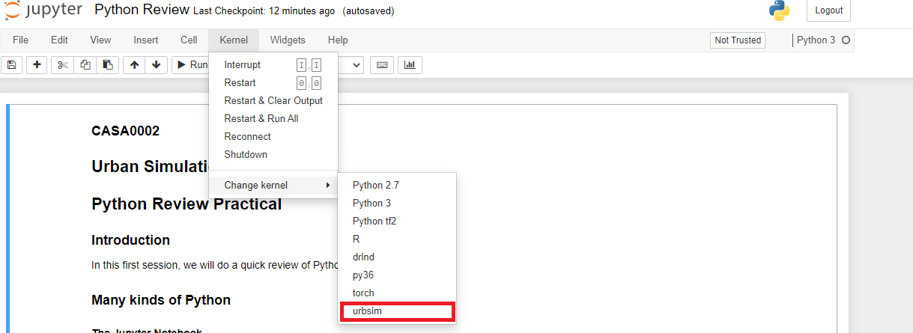

# Urban Simulation Practicals

This repository contains material related to CASA's Urban Simulation module. 

### Dependencies 

To set up your python environment to run the code in this repository, follow the instructions below.

1. Download and install [anaconda](https://www.anaconda.com/)
2. Open command prompt (or terminal if on Mac) 
3. Install Jupyter Notebook if not already installed
    ```bash
    conda install -c conda-forge notebook
    ```
5. Download and save the environment.yml from this repository into a local folder. 
6. From command prompt (or terminal) navigate to the directory where you saved environment.yml file: example bellow
    ```bash
    cd C:\Users\username\git\urban_simulation
    ```
7. Create a new environment using the environment.yml file and activate environment.
    - __Linux__ or __Mac__: 
    ```bash
    conda env create -f environment.yml 
    source activate urbsim
    ```
    - __Windows__: 
    ```bash
    conda env create -f environment.yml 
    activate urbsim
    ```
8. Create a [IPython kernel](http://ipython.readthedocs.io/en/stable/install/kernel_install.html) for the `urbsim` environment.  
    ```bash
    python -m ipykernel install --user --name urbsim --display-name "urbsim"
    ```
10. Launch jupyter notebook
    ```bash
    jupyter notebook
    ```
11. Before running code in a notebook, change the kernel to match the `urbsim` environment by using the drop-down `Kernel` menu. 


